# Open Agent Platform - Complete Setup Guide

This repository contains a complete Open Agent Platform setup with all necessary components:
- **LangConnect**: RAG (Retrieval-Augmented Generation) server for document management (connects directly to OAP)
- **Simple Math MCP Server**: Model Context Protocol server providing math tools
- **OAP LangGraph Tools Agent**: Pre-built agent with MCP tool support
- **Open Agent Platform**: Web-based interface for creating and managing agents with direct RAG integration

## Architecture Overview

The Open Agent Platform consists of multiple interconnected services that work together to provide a complete AI agent experience with RAG capabilities and external tool integration.

```mermaid
graph TB
    User["👤 User"] 
    
    subgraph "Frontend Layer"
        OAP["🌐 Open Agent Platform<br/>(Web Interface)<br/>Port: 3001"]
    end
    
    subgraph "Agent Layer"
        Agent["🤖 OAP LangGraph<br/>Tools Agent<br/>Port: 2024"]
    end
    
    subgraph "Service Layer"
        RAG["📚 LangConnect<br/>RAG Server<br/>Port: 8080"]
        MCP["🔢 Simple Math<br/>MCP Server<br/>Port: 8000"]
    end
    
    subgraph "Data Layer"
        DB["🗄️ PostgreSQL<br/>with pgvector<br/>Port: 5432"]
        Auth["🔐 Supabase<br/>Authentication"]
    end
    
    %% User interactions
    User -->|"HTTP/WebSocket"| OAP
    
    %% Web Platform connections
    OAP -->|"REST API<br/>Agent Operations"| Agent
    OAP -->|"REST API<br/>Direct RAG Access"| RAG
    OAP -->|"Authentication"| Auth
    
    %% Agent connections
    Agent -->|"MCP Protocol<br/>Tool Requests"| MCP
    Agent -->|"Authentication"| Auth
    
    %% Service connections
    RAG -->|"SQL Queries<br/>Vector Search"| DB
    
    %% Styling
    classDef frontend fill:#e1f5fe
    classDef agent fill:#f3e5f5
    classDef service fill:#e8f5e8
    classDef data fill:#fff3e0
    
    class OAP frontend
    class Agent agent
    class RAG,MCP service
    class DB,Auth data
```



### Key Architecture Features:

- **Layered Design**: Clear separation between frontend, agent, service, and data layers
- **Direct RAG Integration**: The web platform connects directly to LangConnect for document management
- **MCP Tool Integration**: Agents can access external tools through the Model Context Protocol
- **Unified Authentication**: Supabase handles authentication across all services
- **Scalable Services**: Each component can be scaled independently

## Prerequisites

Before starting, ensure you have the following installed:
- **Docker & Docker Compose**: For running containerized services
- **Python 3.11+**: For running Python services
- **Node.js 18+**: For the web interface
- **UV**: Python package manager (`pip install uv`)
- **Supabase Account**: For authentication (free tier available)

## Step-by-Step Setup

### Step 1: Start LangConnect RAG Server

The LangConnect server provides RAG capabilities for document storage and retrieval.

```bash
cd langconnect

# Start the PostgreSQL database and API server
docker-compose up -d

# Verify the server is running
curl http://localhost:8080/health
```

**What this does:**
- Starts PostgreSQL with pgvector extension on port 5432
- Starts LangConnect API server on port 8080
- Provides endpoints for managing collections and documents

**Available at:** http://localhost:8080/docs (API documentation)

### Step 2: Start Simple Math MCP Server

The MCP server provides external tools that agents can use.

```bash
cd simple-math-mcp-server

# Stop and remove any existing container
docker stop math-mcp-server && docker rm math-mcp-server

# Build the Docker image
docker build -t simple-math-mcp-server .

# Run the MCP server container
docker run -d -p 8000:8000 --name math-mcp-server simple-math-mcp-server

# Verify the server is running
curl http://localhost:8000/health
```

**What this does:**
- Starts the MCP server on port 8000
- Provides math tools (addition, etc.) via MCP protocol
- Exposes `/mcp` endpoint for tool communication

**Available at:** http://localhost:8000/health (health check)

### Step 3: Configure and Start OAP LangGraph Tools Agent

The tools agent connects to the MCP server to provide additional tool capabilities. Note that RAG functionality is handled directly by the Open Agent Platform.

```bash
cd oap-langgraph-tools-agent

# Create virtual environment
uv venv
source .venv/bin/activate  # On Windows: .venv\Scripts\activate

# Install dependencies
uv sync

# Set up environment variables
cp .env.example .env
```

**Configure the `.env` file:**
```bash
# LangSmith (optional but recommended for tracing)
LANGCHAIN_PROJECT="oap-tools-agent"
LANGCHAIN_API_KEY="your_langsmith_api_key"
LANGCHAIN_TRACING_V2=true

# AI Model API Keys (at least one required)
OPENAI_API_KEY="your_openai_api_key"
# OR
ANTHROPIC_API_KEY="your_anthropic_api_key"

# Supabase Authentication (required)
SUPABASE_URL="your_supabase_project_url"
SUPABASE_KEY="your_supabase_service_role_key"
```

**Start the agent:**
```bash
# Start the LangGraph server
uv run langgraph dev --no-browser
```

**What this does:**
- Starts the LangGraph tools agent on port 2024
- Provides authentication via Supabase
- Integrates with MCP servers for external tools
- Exposes agent endpoints for the web platform

**Available at:** http://localhost:2024 (LangGraph server)

### Step 4: Configure and Start Open Agent Platform

The web platform provides the user interface for creating, configuring, and interacting with agents.

```bash
cd open-agent-platform/apps/web

# Install dependencies
bun install

# Set up environment variables
cp .env.example .env.local
```

**Configure the `.env.local` file:**
```bash
# Base API URL
NEXT_PUBLIC_BASE_API_URL="http://localhost:3001/api"

# LangSmith (optional)
LANGSMITH_API_KEY="your_langsmith_api_key"
NEXT_PUBLIC_USE_LANGSMITH_AUTH="false"

# Agent deployments - Configure your tools agent
NEXT_PUBLIC_DEPLOYMENTS='[
  {
    "url": "http://localhost:2024",
    "name": "Tools Agent",
    "description": "Agent with RAG and MCP tool capabilities"
  }
]'

# RAG Server URL (LangConnect)
NEXT_PUBLIC_RAG_API_URL="http://localhost:8080"

# MCP Server Configuration
NEXT_PUBLIC_MCP_SERVER_URL="http://localhost:8000"
NEXT_PUBLIC_MCP_AUTH_REQUIRED="false"

# Supabase Authentication (same as tools agent)
NEXT_PUBLIC_SUPABASE_ANON_KEY="your_supabase_anon_key"
NEXT_PUBLIC_SUPABASE_URL="your_supabase_project_url"

# Optional: Disable Google Auth if not needed
NEXT_PUBLIC_GOOGLE_AUTH_DISABLED="true"
```

**Start the platform:**
```bash
# Start the development server
bun run dev
```

**What this does:**
- Starts the web interface on port 3001
- Connects directly to LangConnect RAG server for document management
- Connects to Tools Agent for LangGraph-based agents with MCP tools
- Provides UI for agent creation, configuration, and interaction
- Handles authentication via Supabase

**Available at:** http://localhost:3001 (Web interface)

## Verification and Testing

### 1. Check All Services Are Running

```bash
# LangConnect RAG Server
curl http://localhost:8080/health

# Simple Math MCP Server  
curl http://localhost:8000/health

# Tools Agent (requires auth)
curl http://localhost:2024/health

# Web Platform
curl http://localhost:3001
```

### 2. Test the Complete Flow

1. **Access the web platform:** http://localhost:3001
2. **Sign up/Sign in** using Supabase authentication
3. **Set up RAG collections (if needed):**
   - Navigate to the RAG section
   - Create collections and upload documents
   - This is handled directly by the platform, not through agents
4. **Create a new agent:**
   - Select the "Tools Agent" deployment
   - Configure agent settings
   - Add MCP tools (math operations)
5. **Test the complete system:**
   - Test RAG functionality through the RAG interface
   - Test agent with math questions like "What is 15 + 27?"
   - Verify both RAG and agent tools work correctly

## Service URLs Summary

| Service | URL | Purpose |
|---------|-----|---------|
| Open Agent Platform | http://localhost:3001 | Web interface for agent management |
| OAP Tools Agent | http://localhost:2024 | LangGraph agent with tools |
| LangConnect RAG | http://localhost:8080 | Document storage and retrieval |
| Simple Math MCP | http://localhost:8000 | Math tools via MCP protocol |

## Environment Variables Summary

### Required for All Services
- **Supabase URL & Keys**: For authentication across all services
- **AI Model API Key**: OpenAI or Anthropic for agent functionality

### Optional but Recommended
- **LangSmith API Key**: For tracing and debugging
- **Custom Deployment URLs**: If hosting services remotely

## Troubleshooting

### Common Issues

1. **Port Conflicts**: Ensure ports 3001, 2024, 8080, 8000, and 5432 are available
2. **Authentication Issues**: Verify Supabase configuration is consistent across services
3. **Service Dependencies**: Start services in order (LangConnect → MCP → Tools Agent → Platform)
4. **Environment Variables**: Double-check all required environment variables are set

### Logs and Debugging

```bash
# Check Docker service logs
docker-compose logs -f

# Check LangGraph agent logs
cd oap-langgraph-tools-agent
uv run langgraph dev --no-browser --verbose

# Check web platform logs
cd open-agent-platform/apps/web
bun run dev
```

### Health Checks

Each service provides health check endpoints:
- LangConnect: `GET /health`
- MCP Server: `GET /health`  
- Tools Agent: `GET /health` (requires auth)
- Web Platform: `GET /` (returns 200 if running)

## Production Deployment

For production deployment:

1. **Use proper environment variables** (not localhost URLs)
2. **Set up proper authentication** with production Supabase project
3. **Use Docker Compose** for service orchestration
4. **Configure reverse proxy** (nginx) for SSL and routing
5. **Set up monitoring** and logging for all services
6. **Use managed databases** instead of local PostgreSQL

## Support and Documentation

- **Open Agent Platform**: [GitHub Repository](https://github.com/langchain-ai/open-agent-platform)
- **LangConnect**: [Documentation](https://github.com/langchain-ai/langconnect)
- **LangGraph**: [Documentation](https://langchain-ai.github.io/langgraph/)
- **MCP Protocol**: [Specification](https://spec.modelcontextprotocol.io/)

## License

This project is licensed under the MIT License - see the LICENSE file for details. 